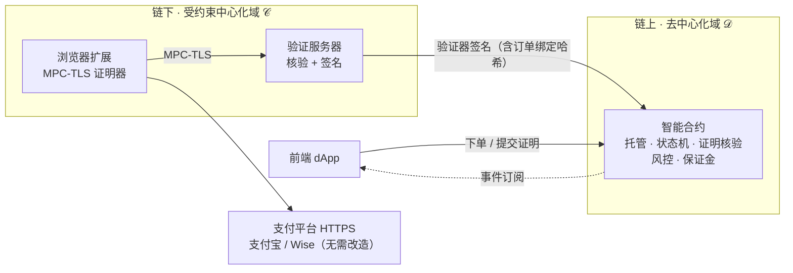

# C2C zkTLS Exchange Protocol

### 半去中心化 C2C 法币 ↔ 加密货币兑换协议

**把链下支付（支付宝 / Wise 转账）变成链上合约可直接核验的密码学证明。**
_Turn off-chain Alipay / Wise payments into on-chain-verifiable cryptographic proofs._

[🚀 快速上手](docs/zh/hands-on/01-quickstart.md) · [📚 中文文档](docs/zh/README.md) · [📖 English Docs](docs/en/README.md) · [📄 论文信息](docs/zh/thesis.md)

---

> [!NOTE]
> 硕士论文配套开源实现。文档所有事实以**实际代码与源数据**为准，代码引用均写 `文件:行号`，可点击核对。

## 中文

### 🎯 这是什么

一套让 **链下法币支付事实被链上智能合约直接、密码学地验证** 的 C2C 兑换协议。链下用 MPC-TLS（TLSNotary）生成支付证明，验证服务器签名后在链上核验；资产托管与订单状态在链上确定性执行。两大创新：

- **① 订单绑定哈希** —— 把链下证明与链上订单密码学绑定，防证明跨单复用 / 篡改。
- **② 半去中心化双域架构** —— 链上去中心化执行 + 链下受约束公证。

### 📊 关键数字

| 指标 | 值 |
|---|---|
| 单笔完整换汇链上成本 | ≈ **\$0.13**（Arbitrum One 均值档） |
| 端到端时延（理想 / 宽带） | 支付宝 5.94 s / 17.44 s；Wise 9.74 s / 24.02 s |
| 合约测试 | **实跑 336 passing / 0 失败**（2026-06-02） |
| 支持平台 | 支付宝、Wise（可扩展接口） |

> [!IMPORTANT]
> 数字均回源数据（CSV / 测试输出 / 合约常量）现场复算，过程见 [评估篇](docs/zh/deep-dive/06-evaluation.md)。

### 🏗 架构一览

### 🧭 选择你的路径

- 🚀 **想跑起来** → [快速上手](docs/zh/hands-on/01-quickstart.md)
- 🧠 **想读懂协议** → [深度轨总览](docs/zh/deep-dive/01-overview.md)
- 📚 **想对照源码** → [源码地图](docs/zh/reference/code-map.md)
- 📖 **完整中文导航** → [docs/zh/README.md](docs/zh/README.md)
- 📄 **论文信息** → [thesis.md](docs/zh/thesis.md)

### 🙏 致谢与归属

构建于 [tlsnotary/tlsn-extension](https://github.com/tlsnotary/tlsn-extension)（TLSNotary / PSE 团队）之上，C2C 协议层为本文贡献。详见 [归属与许可](docs/zh/ATTRIBUTION.md)。

---

## English

> [!NOTE]
> 📖 Full English documentation: **[docs/en/README.md](docs/en/README.md)** (mirrors the Chinese set). This section is a brief overview.

**What is this?** A C2C fiat ↔ crypto exchange protocol that lets **on-chain smart contracts directly and cryptographically verify off-chain payment facts**. Off-chain payments (Alipay / Wise) are proven via MPC-TLS (TLSNotary), signed by a verifier server, and verified on-chain; asset custody and order state execute deterministically on-chain. Two contributions: an **order-binding hash** (prevents cross-order proof reuse / tampering) and a **semi-decentralized dual-domain architecture** (decentralized on-chain execution + constrained off-chain notarization).

**Key numbers:** ≈ \$0.13 on-chain cost per complete exchange (Arbitrum One, mean tier); end-to-end latency 5.94 s / 9.74 s (Alipay / Wise, ideal); contract tests 336 passing (live run, 2026-06-02).

**License:** Apache-2.0 OR MIT. Built on [tlsnotary/tlsn-extension](https://github.com/tlsnotary/tlsn-extension); C2C protocol layer © 2026 looikaizhi. See [ATTRIBUTION](docs/en/ATTRIBUTION.md).
