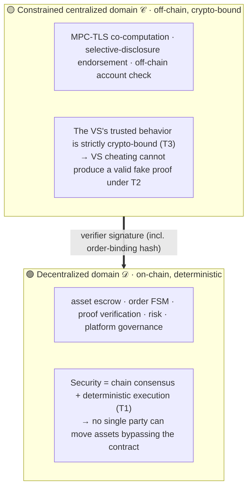
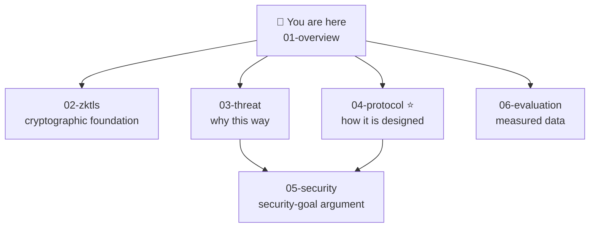

# Overview: the Protocol at a Glance

> [!NOTE]
> **Reading guide**
> - **Purpose**: the deep-dive entry point — one page on what problem the protocol solves, how, where the innovations are, and where to go next.
> - **Audience**: readers who want to understand the protocol. After this, follow the "reading map" to go deeper.
> - **Thesis source**: abstract, ch1.3, ch4.1. All facts follow the source.

**Contents**: [Core problem](#1-the-core-problem) · [Dual-domain architecture](#2-the-solution-a-semi-decentralized-dual-domain-architecture) · [Four layers](#3-four-layer-architecture) · [Two innovations](#4-the-two-innovations-preview) · [Three properties](#5-three-properties-at-once-vs-existing-solutions) · [Key results](#6-key-measured-results-preview) · [Reading map](#7-reading-map)

---

## 1. The core problem

Demand for fiat ↔ crypto C2C exchange keeps rising, but existing solutions rely on "platform matching + asset custody + manual arbitration":

> [!IMPORTANT]
> **Off-chain payment facts cannot be directly verified by on-chain contracts** — a bank/payment-platform transfer status exists only in a third-party HTTPS response, which the blockchain cannot natively access, and a user-submitted screenshot/receipt can be forged. So transaction security can only rest on trust in a centralized platform.

The core problem of this work: **how, without an intermediary, to turn an off-chain payment into an on-chain-verifiable cryptographic proof?**

---

## 2. The solution: a semi-decentralized dual-domain architecture

The system is split into two trust domains with **fully decoupled failure modes** (thesis ch3.1.4, ch4.7.2):

Off-chain, MPC-TLS turns a payment fact into a cryptographic proof; after the VS signs it, it is **verified directly inside the on-chain contract**. The VS holds no assets; its failure only affects availability, not already-escrowed assets. Trust is squeezed to the weakest assumption: "only trust that the VS does not collude with the buyer to forge the payment platform's TLS response." See [03-threat-model.md](03-threat-model.md).

---

## 3. Four-layer architecture

| Layer | Responsibility | Code package |
|---|---|---|
| On-chain contract layer | Escrow, order FSM, proof verification, risk control, bonds | [`contracts`](../../../tlsn-extension/packages/contracts/) |
| Off-chain proof layer | Browser extension (prover) + verifier server VS | [`extension`](../../../tlsn-extension/packages/extension/) + [`verifier`](../../../tlsn-extension/packages/verifier/) + [`plugin-sdk`](../../../tlsn-extension/packages/plugin-sdk/) |
| Payment-platform integration layer | Alipay/Wise HTTPS APIs, **no modification** | — |
| Frontend interaction layer | Buyer/merchant web UI, holds no private keys | [`web`](../../../tlsn-extension/packages/web/) |

The system supports **bidirectional CRYPTO/FIAT products** (a mirror structure) and integrates Alipay and Wise via an extensible verifier interface. For package responsibilities, see [reference/code-map.md](../reference/code-map.md).

---

## 4. The two innovations (preview)

### Innovation ① Order-binding hash H_bind
**Cryptographically binds** an off-chain TLS proof to a specific on-chain order + payer/payee accounts: the verifier signature digest embeds `H_bind` (15-field keccak256); any parameter tampering → rebuilt hash mismatch → recovered signer not in the allowlist → reject. **This fundamentally blocks cross-order reuse and parameter tampering**, with no extra timing constraint. See [04 §6.2](04-protocol-design.md).

### Innovation ② Semi-decentralized dual-domain architecture
"Decentralized on-chain execution + constrained off-chain notarization": under the current condition that fully-decentralized zkTLS latency is still too high (tens of minutes on consumer devices), it achieves a **balance of trust minimization and deployability**. The architecture reserves an interface to integrate zkTLS in the future, allowing a smooth migration to full decentralization once performance is adequate. See [03-threat-model.md §4](03-threat-model.md).

> [!TIP]
> This also explains **why account-identity verification is designed off-chain** (the VS's accountCheck): there is currently no way to verify identity on-chain without leaking privacy, and the on-chain account-check entry is reserved for a future fully-decentralized phase. See [04 §7](04-protocol-design.md).

---

## 5. Three properties at once (vs existing solutions)

Thesis Table 2-2: this scheme is the only one of the four mainstream routes that **achieves all three properties while supporting fiat exchange**:

| Property | Centralized exchange | P2P OTC | On-chain DEX+oracle | **This work** |
|---|:---:|:---:|:---:|:---:|
| Supports fiat exchange | ✓ | ✓ | ✗ | **✓** |
| Trustless asset custody | ✗ | ✗ | ✓ | **✓** |
| Cryptographically verifiable payment proof | ✗ | ✗ | N/A | **✓** |
| On-chain account-identifier privacy | ✗ | ✗ | N/A | **✓** |

The cost: a weak trust in the verifier server + limited single-point-of-failure resistance under the current single-node deployment — the inherent engineering trade-off of semi-decentralization.

---

## 6. Key measured results (preview)

- On-chain cost of a complete exchange ≈ **\$0.13** (Arbitrum One, mean tier).
- End-to-end latency: Alipay 5.94 s (ideal) / 17.44 s (broadband); Wise 9.74 s / 24.02 s.
- Contract tests **336 passing / 0 failing** (live run, 12 suites, `hardhat test`).

See [06-evaluation.md](06-evaluation.md).

---

## 7. Reading map

| To understand… | Go to |
|---|---|
| Why off-chain payments can be verified on-chain (cryptography) | [02-zktls-tlsnotary.md](02-zktls-tlsnotary.md) |
| Why it is designed this way (threats & trust assumptions) | [03-threat-model.md](03-threat-model.md) |
| How the protocol & system are designed (incl. the two innovations) | [04-protocol-design.md](04-protocol-design.md) ⭐ |
| How security goals S1–S5 are argued | [05-security-analysis.md](05-security-analysis.md) |
| Measured performance (Gas/latency) | [06-evaluation.md](06-evaluation.md) |
| Thesis concept ↔ source location | [reference/code-map.md](../reference/code-map.md) |
| Term lookup | [reference/glossary.md](../reference/glossary.md) |

> [!TIP]
> Want to run it? Take the [hands-on track](../hands-on/01-quickstart.md).

---

🏠 [Docs home](../README.md) · Next ▶ [02 · zkTLS & TLSNotary](02-zktls-tlsnotary.md)

