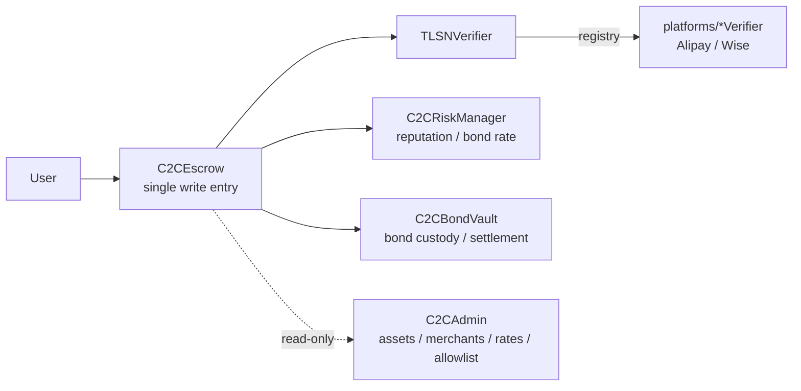
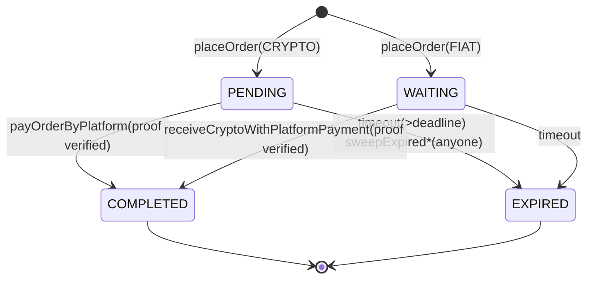

# Protocol & System Design ⭐

> [!NOTE]
> **Reading guide**
> - **Purpose**: the main page on protocol and system design, including the two innovations. Understand this page and you understand the thesis work.
> - **Audience**: deep-dive track.
> - **Prerequisites/companions**: [01-overview.md](01-overview.md), [02-zktls-tlsnotary.md](02-zktls-tlsnotary.md); [reference/contracts.md](../reference/contracts.md), [reference/code-map.md](../reference/code-map.md).
> - **Thesis source**: ch4.1–4.6. All facts follow the source.

**Contents**: [Layered architecture](#1-layered-architecture--components) · [Dual-protocol mirror](#2-crypto--fiat-dual-protocol-mirror) · [Five contracts](#3-on-chain-contract-layer-five-contracts) · [Order FSM](#4-order-state-machine) · [Off-chain proof layer](#5-off-chain-proof-layer) · [Innovation ① order binding](#6-innovation--selective-disclosure-spec--order-binding-digest) · [Platform verifiers](#7-platform-verifiers) · [Risk management](#8-risk-management) · [Compliance & Webhook](#9-compliance-fields--webhook)

---

## 1. Layered architecture & components

Four vertically separated layers (thesis ch4.1.1), with cross-layer dependencies fixed as standard interfaces:

| Layer | Responsibility | Code package |
|---|---|---|
| On-chain contract layer | Asset escrow, order FSM, proof verification, risk control, bonds | [`contracts`](../../../tlsn-extension/packages/contracts/) |
| Off-chain proof layer | Browser extension (prover) + verifier server (VS) | [`extension`](../../../tlsn-extension/packages/extension/) + [`verifier`](../../../tlsn-extension/packages/verifier/) + [`plugin-sdk`](../../../tlsn-extension/packages/plugin-sdk/) |
| Payment-platform integration layer | Third-party payment HTTPS APIs (Alipay/Wise), no modification needed | — |
| Frontend interaction layer | Buyer/merchant web UI, holds no private keys | [`web`](../../../tlsn-extension/packages/web/) |

The **only coupling point** between on-chain and off-chain = the proof-submission interface + the event-subscription channel. For detailed package responsibilities, see [code-map.md](../reference/code-map.md).

---

## 2. CRYPTO / FIAT dual-protocol mirror

The two product types form a complete mirror along three dimensions (thesis ch4.1.2), sharing the same contract logic and platform-verifier interface; they differ only in the parameterization of order initial state, prover role, and bond source:

| Dimension | CRYPTO product (merchant sells crypto) | FIAT product (merchant buys crypto) |
|---|---|---|
| Asset flow | Merchant locks crypto → buyer pays fiat → release crypto to buyer | Buyer locks crypto → merchant pays fiat → release crypto to merchant |
| Paying & proving party | **Buyer** (pays fiat + generates proof) | **Merchant** (pays fiat + generates proof) |
| Bond source | Buyer deposits bond at order placement | Merchant bond drawn from collateral |
| Initial state | `PENDING` | `WAITING` |
| Settlement function | [`payOrderByPlatform`](../../../tlsn-extension/packages/contracts/contracts/C2CEscrow.sol#L609) | [`receiveCryptoWithPlatformPayment`](../../../tlsn-extension/packages/contracts/contracts/C2CEscrow.sol#L670) |

In code, the two branches of `placeOrder` are this mirror: CRYPTO buyer pays bond ([C2CEscrow.sol:503-528](../../../tlsn-extension/packages/contracts/contracts/C2CEscrow.sol#L503-L528)), FIAT merchant bond drawn from collateral ([:537-565](../../../tlsn-extension/packages/contracts/contracts/C2CEscrow.sol#L537-L565)).

---

## 3. On-chain contract layer (five contracts)

Five core contracts + the platform verifiers, with the escrow as the single write entry (thesis ch4.2.1):



For a quick reference of interfaces, events, and permissions, see [contracts.md](../reference/contracts.md). The "single write entry + read-only config hub + registry dispatch" structure keeps things modular while staying under the EVM 24.5 KB contract size limit.

---

## 4. Order state machine

A finite state automaton (thesis ch4.2.5, eq:ch4-order-fsm):



- `Q = {PENDING, WAITING, COMPLETED, EXPIRED}`, terminal `F = {COMPLETED, EXPIRED}` ([C2CTypes.sol:13-18](../../../tlsn-extension/packages/contracts/contracts/C2CTypes.sol#L13-L18)).
- `cancelOrder` is **disabled** ([:601-603](../../../tlsn-extension/packages/contracts/contracts/C2CEscrow.sol#L601-L603) reverts `OrderCancellationDisabled`).
- Four structural invariants: I₁ fund conservation, I₂ single active order, I₃ terminal irreversibility, I₄ bond binding (thesis ch4.2.5).
- **Expiry cleanup is permissionless**: anyone can call `sweepExpired*` ([:889-908](../../../tlsn-extension/packages/contracts/contracts/C2CEscrow.sol#L889-L908)); the off-chain [keeper](../../../tlsn-extension/packages/keeper/) is merely a convenience and holds no privilege.

> [!NOTE]
> State names are from the buyer's perspective: `PENDING` = buyer to prove, `WAITING` = buyer waiting for the merchant to prove.

---

## 5. Off-chain proof layer

Thesis ch4.3. Three engineering decisions:

1. **VS directly acts as the MPC-TLS verifier**: the standalone Notary role of the original TLSNotary protocol is removed; the business verifier server VS directly participates in TLS key splitting and signs, collapsing the "Notary signs → business reviews" two-stage trust chain into one.
2. **QuickJS sandbox isolation**: plugins run in a WASM sandbox that blocks host network/filesystem; capabilities are injected by the Host ([plugin-sdk/src/index.ts:455-463](../../../tlsn-extension/packages/plugin-sdk/src/index.ts#L455-L463)). See [05-security-analysis.md](05-security-analysis.md) S5.
3. **Service Worker + Offscreen Document decoupling**: proof computation runs in an offscreen document, avoiding blocking the request-management event loop.

The proof tuple `π = (σ_VS, {cᵢ}, H_bind, sid)` (thesis eq:ch4-proof-tuple). Generation flow: HTTP response capture → selective commitment computation → VS signing (with the order-binding extension). For the principles, see [02-zktls-tlsnotary.md](02-zktls-tlsnotary.md).

---

## 6. Innovation ①: selective-disclosure spec & order-binding digest

### 6.1 Selective disclosure (Handlers)

Field-level control ([plugin-sdk](../../../tlsn-extension/packages/plugin-sdk/)): each Handler declares direction (`SENT`/`RECV`) + message part + action (`REVEAL`/`PEDERSEN`) + optional granular params.
- `REVEAL`: outputs the plaintext slice + blinder, so the commitment opening is on-chain verifiable.
- `PEDERSEN`: outputs only the commitment hash; the plaintext and blinder never leave the device.

Commitments are instantiated as the EVM-native `keccak256`: `cᵢ = keccak256(bytes(fᵢ) ‖ rᵢ)`; aggregation `H_comm = keccak256(c₁ ‖ … ‖ cₙ)` (thesis eq:ch4-commit-item/agg). This system's disclosure ratio is 20%–35% (amount/time in plaintext, account hashes committed).

### 6.2 Order-binding hash H_bind (the core innovation)

Computed at order creation, it **cryptographically binds** an off-chain proof to a specific on-chain order + payer/payee accounts.

**15 fields total** keccak256 ([`_computeOrderBindingHash`, C2CEscrow.sol:381-413](../../../tlsn-extension/packages/contracts/contracts/C2CEscrow.sol#L381-L413)):

```
H_bind = keccak256(
  escrow, chainId, merchant, buyer, productId, orderId, assetType,
  amount, rate, rateVersion, deadline,
  merchantNameHash, merchantIdHash, payeeNameHash, payeeIdHash )
```

`H_bind` is passed off-chain as sessionData and covered by the VS signature digest; on-chain it is rebuilt from the same parameters and compared ([`_requireOrderBinding`:423-425](../../../tlsn-extension/packages/contracts/contracts/C2CEscrow.sol#L423-L425)). **Any parameter tampering → rebuilt H_bind mismatch → recovered signer not in the allowlist → reject**. This eliminates the room to "transplant a valid proof to another order" without any extra timing constraint.

> [!TIP]
> Among the 15 fields, the 4 account hashes (merchant and buyer payer/payee, each name+id) are flattened directly into the binding, locking the payer/payee identities in; `rateVersion` brings the rate version into the binding too — a proof generated for an old order with a new rate version is rejected on H_bind mismatch (verified by the rate-snapshot test `RATE-07`).

There is also `orderKey` (the bond isolation key) = 6 fields ([`_orderKey`:431-440](../../../tlsn-extension/packages/contracts/contracts/C2CEscrow.sol#L431-L440)): `keccak256(escrow, chainId, merchant, productId, assetType, orderId)`.

---

## 7. Platform verifiers

Thesis ch4.4. Unified interface `IPlatformVerifier`: after `TLSNVerifier` completes the five-step cryptographic verification, it delegates business-rule matching to the platform verifier. For the interface, Alipay/Wise rules, and steps to add a new platform, see [verifier-plugin.md](../reference/verifier-plugin.md).

**Account-identity verification is done off-chain by the VS** (thesis ch4.4.2): before signing, the VS extracts the payee account identifier from the response and **compares it off-chain** against the merchant's on-chain pre-registered account hash; it signs only after this passes. The TLSNProof struct contains no account plaintext; the existence of the VS signature is itself proof that account verification passed. In the two-proof Wise flow, the contacts proof likewise must pass cryptographic verification with a trusted serverName, and its account content is verified off-chain by the VS.

> [!IMPORTANT]
> **Design intent**: the on-chain platform verifier does not compare accounts; account matching is designed off-chain — there is currently no way to verify identity on-chain without leaking privacy (running zk over the whole protocol would significantly increase latency and fees, bad for every party), so the pragmatic "off-chain accountCheck + verifier signature" approach is used; the on-chain account-check entry point is reserved for a future fully-decentralized phase (it can migrate on-chain smoothly once zkTLS performance is sufficient).

**paramsData = 4 fields**: `(fiatAmountX1000, targetCurrency, orderDeadline, orderCreationTime)`; the payment time must fall within the `[created, deadline]` window, preventing reuse of old/expired transfers ([IPlatformVerifier.sol:10-18](../../../tlsn-extension/packages/contracts/contracts/interfaces/IPlatformVerifier.sol#L10-L18)).

---

## 8. Risk management

Thesis ch4.5. Two-sided bonds + dynamic rate + reputation escalation. For detailed parameters, see [contracts.md §2.3](../reference/contracts.md).

- **Bond amount**: `bond = amt × bondBps / 10000` (thesis eq:ch4-bond-calc; code `Math.mulDiv`, [C2CEscrow.sol:505,539](../../../tlsn-extension/packages/contracts/contracts/C2CEscrow.sol#L505)). bps is snapshotted at order placement and fixed for the order's life.
- **Tiered rate**: `bondBps(ℓ) = clamp(base + ℓ×step, min, max)`. Defaults base=1000(10%), step=300(3%/level), min=500(5%), max=10000(100%); ℓ=10 → 40% (does not hit the 100% cap; the cap is an adjustable extreme — admin can raise base/step when regulation tightens).
- **Reputation escalation**: timeout → level +1 and consecutive-timeout counter +1 (consecutive timeouts add 1/2/3 progressively, [onTimeout:172-193](../../../tlsn-extension/packages/contracts/contracts/C2CRiskManager.sol#L172-L193)); success → reset consecutive timeouts, and 3 consecutive completions lower the level by 1; cumulative timeouts reaching 15 → temporary freeze for 30 days; reputation decays over time (1 level / 90 days).
- **Bond-vault per-order isolation + idempotent settlement** ([C2CBondVault.sol](../../../tlsn-extension/packages/contracts/contracts/C2CBondVault.sol)): refunded to the prover on success, to the counterparty on timeout.
- **Pull-mode settlement**: the bond is `_credit`ed to claimable first, and the user calls `claim()` to withdraw; `initClaimable` writes a sentinel to warm up the storage slot and save gas (see [contracts.md §2.4](../reference/contracts.md)).

Two-sided bonds form a "symmetric default incentive": whichever party defaults (times out) → its bond is forfeited to the counterparty. For the economic-security analysis, see [05-security-analysis.md](05-security-analysis.md).

---

## 9. Compliance fields & Webhook

Thesis ch4.6. Dual-channel archiving:

- **On-chain events**: events fire at proof-success/timeout/settlement nodes, permanently recording the buyer/merchant addresses, account-identifier hashes (no plaintext exposed), amount/rate, timestamps, and the platform-side transaction ID, satisfying FATF R.11's five-year retention.
- **Off-chain Webhook**: after verification, the VS asynchronously pushes a `SlimWebhookPayload` (Travel Rule fields + reveal-range offsets only, **no plaintext / raw transcripts**), routed differentially by server name (with `*` wildcard), fire-and-forget (a push failure does not block the main flow). For implementation and config, see [verifier-plugin.md §5](../reference/verifier-plugin.md).

---

> [!TIP]
> How these mechanisms guarantee the security goals: see [05-security-analysis.md](05-security-analysis.md); for measured performance see [06-evaluation.md](06-evaluation.md); for the cryptographic principles see [02-zktls-tlsnotary.md](02-zktls-tlsnotary.md).

---

<div align="center">

◀ Prev [03 · Threat model](03-threat-model.md) · 🏠 [Docs home](../README.md) · Next ▶ [05 · Security analysis](05-security-analysis.md)

</div>
