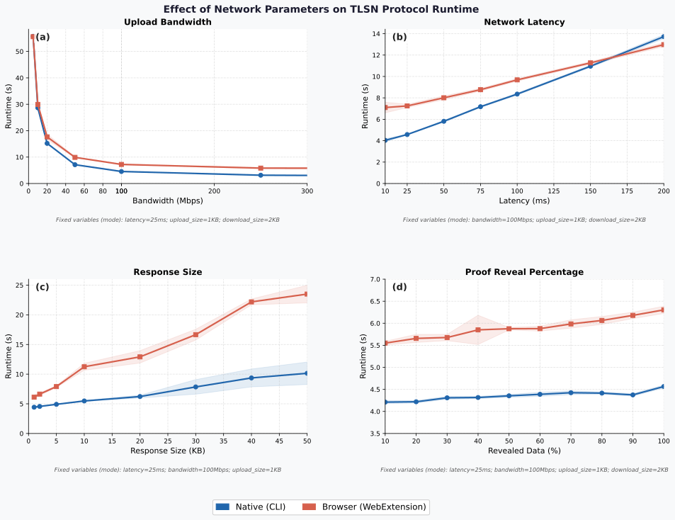
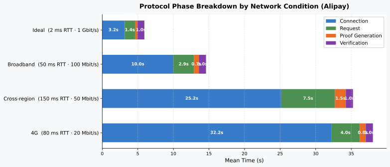
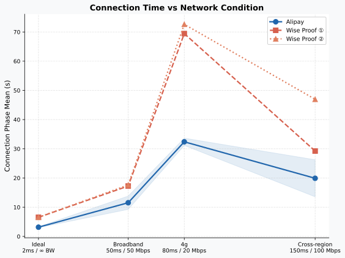

# Evaluation: Measured Data

> **Purpose**: convince with measured data — contract correctness, on-chain gas economics, TLSNotary performance, end-to-end latency.
> **Audience**: deep-dive track / reviewers.
> **Data sources**: contract tests [`contracts/TEST_RESULT.md`](../../../tlsn-extension/packages/contracts/TEST_RESULT.md); experimental data [`data_analysis/`](../../../data_analysis/) (`*.csv` sources, `*.svg` charts).
> **Recomputation principle**: every number here is recomputed live from the source data (CSV / test output / contract constants).

---

## 1. Contract functional correctness

`npx hardhat test` (Hardhat 3.1 + Node test runner), Solidity 0.8.28, EVM cancun. Each case runs in an isolated EVM snapshot, fully isolated between cases.

**Result: a local live run (WSL `hardhat test`) gives 336 passing / 0 failing, all pass** (node:test count, including 7 helper module files, ~329 business cases). The per-suite breakdown below is taken from the [TEST_RESULT.md](../../../tlsn-extension/packages/contracts/TEST_RESULT.md) archive.

| Suite | Cases | Suite | Cases |
|---|---:|---|---:|
| C2CAdmin | 60 | TLSN verifier | 30 |
| C2CEscrow (V4) | 62 | Rate snapshot | 9 |
| WisePlatform verifier | 34 | Per-order cap | 6 |
| AlipayPlatform verifier | 37 | Business hours | 14 |
| Integration (V4) | 17 | Bond two-sided fairness (V4) | 22 |
| Expired-order cleanup | 11 | Public Sweep (V4) | 22 |
| | | **Total** | **324** |

Cases are organized as `FLOW` (positive) / `ERR` (error path) / `ATT` (attack vector) / `TAMPER` (timing tamper), covering state transitions, asset conservation, and the five-step cryptographic verification pipeline (order-binding-hash substitution, session replay, signature forgery, chain-ID substitution, and amount tampering all revert as expected).

> 💡 The test suite keeps growing (contract-logic iterations add cases); the live figure follows the local `hardhat test` output. The TLSN-verifier suite includes a "real-verifier 5-item signature format passes, legacy 4-item rejected by `UntrustedVerifier`" case, confirming that the current signature digest is 5 fields (incl. `orderBindingHash`, `policyVersionHash`).

---

## 2. On-chain gas & economics

### 2.1 Calculation method

$$\text{Total fee (USD)} = \text{Gas Used} \times \text{Gas Price (gwei)} \times 10^{-9} \times \text{ETH price (USD)}$$

- **Gas Used**: measured in Hardhat local simulation, 5 runs averaged per operation (execution gas only, excluding L1 data fee).
- **Gas Price**: fitted from Arbitrum One history (~791 days post-Dencun), μ=0.062 gwei, σ=0.047, median ≈0.040 gwei. Three tiers: floor 0.01 / mean 0.062 / congested 0.11 gwei.
- **ETH price**: $3,000.

### 2.2 Per-operation gas baselines (measured)

From [TEST_RESULT.md](../../../tlsn-extension/packages/contracts/TEST_RESULT.md) and thesis Table 6-2 (consistent):

| Operation | Gas |
|---|---:|
| ERC-20 `approve` (first cold write) | 46,000 |
| Place order CRYPTO | 198,500 |
| Place order FIAT | 215,300 |
| Submit proof · Alipay CRYPTO | 437,706 |
| Submit proof · Wise CRYPTO (two proofs) | 488,213 |
| Timeout bond claim | 147,600 |
| Merchant registration (one-time) | 74,966 |
| Set platform account hash | 101,698 |
| List CRYPTO product | 128,400 |

> Proof submission is the single most expensive operation: the longest call chain (Escrow→TLSNVerifier→platform verifier→BondVault→RiskManager), one cold `SSTORE` per cross-contract boundary + per dedup map. Wise's two-proof path is ~12% higher than Alipay's single proof.

### 2.3 Complete-exchange cost (\$0.13 recomputed)

**Scenario A: a buyer completes one Alipay CRYPTO exchange** (first time, taking the cold-write upper bound):

| Step | Gas |
|---|---:|
| `approve` | 46,000 |
| Place order CRYPTO | 198,500 |
| Submit proof · Alipay CRYPTO | 437,706 |
| **Total** | **682,206** |

Recompute the three tiers (682,206 × Gas Price × 1e-9 × \$3000):

| Tier | Gas Price | Cost |
|---|---|---:|
| Floor | 0.01 gwei | ≈ \$0.02 |
| **Mean** | **0.062 gwei** | **≈ \$0.13** |
| Congested | 0.11 gwei | ≈ \$0.23 |

✅ **Recomputation confirmed**: at the mean tier, 682,206 × 0.062 × 3000 × 1e-9 = **\$0.127 ≈ \$0.13** (one complete exchange on Arbitrum One). Wise CRYPTO (scenario B, 732,713 gas) is ~\$0.14 at the mean tier, ~\$0.01 higher.

For a typical exchange size of 100–10,000 USDT, the fee is 0.001%–0.13% at the mean tier, far below mainstream centralized-exchange withdrawal fees (~1–3 USDT).

> Note: the above is execution gas, excluding the L1 data fee. Post-Dencun (EIP-4844), the typical Arbitrum L1 data fee is \$0.001–\$0.02, a negligible share.

---

## 3. TLSNotary protocol performance

Test framework: the official reproducible network framework (tlsnotary.org, 2026-01) + `tc netem` controlled networks. Native (Rust) vs browser (WASM) modes; browser cryptographic throughput is ~40%–60% of native (no AVX2/NEON + V8 JIT overhead + GC pauses). This system's production path is the browser mode. Source data: [`data_analysis/tlsn-experiments/`](../../../data_analysis/tlsn-experiments/).

Four-dimensional parameter sensitivity (10 runs averaged per configuration):

| Dimension | Key conclusion | Chart |
|---|---|---|
| **Bandwidth** (5–1000 Mbps) | Below 20 Mbps data transfer dominates (both modes ≈55s); at high bandwidth the browser is stuck at the WASM compute floor (≈6.1s at 1000 Mbps) while native drops to 2.5s | [bandwidth.svg](../../assets/charts/bandwidth.svg) |
| **Network latency** (10–200 ms) | The MPC-TLS online phase has 40–50 sequential rounds, so total time grows near-linearly with latency; the two modes converge above 150 ms | [latency.svg](../../assets/charts/latency.svg) |
| **Response size** (1–50 KB) | Native near-linear; the browser rises non-linearly after 5–10 KB (23.5s at 50 KB, 2.33× native). This system's API responses are 2–5 KB, in the flat region below the knee | [response_size.svg](../../assets/charts/response_size.svg) |
| **Disclosure ratio** (10%–100%) | Smallest effect (~10%–11% increase across the range). This system's disclosure is 20%–35%, in the completely flat region | [proof_reveal.svg](../../assets/charts/proof_reveal.svg) |

> Key insight: **bandwidth is the primary bottleneck**, and disclosure ratio has the smallest effect — meaning selective disclosure (privacy protection) adds almost no latency cost.

---

## 4. End-to-end business latency

### 4.1 Method

A single physical machine (i7-11800H), with the verifier server on WSL2 Linux and the extension on the Windows side; `tc netem` injects latency/bandwidth at the WSL egress. The payment-platform API is accessed directly over the public internet via the Windows host (unmanaged). Each environment runs 20 times, **discarding the first warm-up and taking the next 19** (so N=19), reporting median and P95. Four-phase breakdown: connection `t_conn`, request `t_req`, proof generation `t_proof`, verification `t_verify` (1s polling granularity).

**Wise takes the larger of its two proofs**: Wise issues an independent proof for each of two endpoints (contact check + transfer detail), run concurrently via `Promise.all` sharing the same compute resources, so they finish nearly simultaneously and the total is taken as the max (not the sum).

Source data: [`data_analysis/wise_alipay/`](../../../data_analysis/wise_alipay/) (`*_ideal/broadband/crossregion/4g.csv`).

### 4.2 Results (median, N=19)

| Service | Ideal | Broadband (50ms/100M) | Cross-region (150ms/50M) | 4G (80ms/20M) |
|---|---:|---:|---:|---:|
| Alipay | **5.94 s** | **17.44 s** | 24.98 s | 37.38 s |
| Wise Proof① | 9.74 s | 21.02 s | 30.23 s | 83.78 s |
| Wise Proof② | 9.69 s | **24.02 s** | 56.87 s | 84.78 s |
| **Wise (max)** | **9.74 s** | **24.02 s** | 56.87 s | 84.78 s |

✅ **Recomputation confirmed** (median of `totalProtocolMs` in [`data_analysis/wise_alipay/*.csv`](../../../data_analysis/wise_alipay/)): Alipay ideal 5.94 s, broadband 17.46 s; Wise ideal max(9.76, 9.70)=9.76, broadband max(20.98, 24.02)=24.02 — consistent with 5.94 / 17.44 / 9.74 / 24.02 (the sub-0.04 s differences come from N=19 dropping the warm-up row, whereas this recomputation uses all valid rows). The abstract's figures are all reproducible from the CSV sources.

### 4.3 Two key findings

**① Counterintuitive: 4G total > cross-region** (Alipay 37.38 s vs 24.98 s).
The connection phase `t_conn` (67%–68% of total) is **bandwidth-dominated**: the MPC offline phase transfers a large OT matrix, and cross-region's 50 Mbps bandwidth advantage outweighs its 150 ms latency disadvantage, so cross-region `t_conn` (19.90 s) is actually lower than 4G (32.40 s). Only the request phase `t_req` is latency-dominated. **Conclusion: for deployment, bandwidth weighs more than round-trip latency.**

**② Wise `t_conn` ≈ 2× Alipay** (measured ratio 2.06× in the ideal environment).
The concurrent dual Prover shares a single Comlink Worker + a single Rayon WASM thread pool, each getting ½ CPU share. Within a round, the `t_conn` difference between Proof①/② stays <10 ms, confirming a fully symmetric contention. This is due to an architectural decision (concurrent shared compute), not a business-complexity difference.

### 4.4 Network applicability boundary

**Under E4 (3G, 300 ms / 2 Mbps), all test runs time out during the MPC handshake.** Two bottlenecks fire at once: latency-dominated (OT Extension's many sequential rounds × 300 ms) + bandwidth-dominated (OT-init large-matrix transfer ÷ 2 Mbps). Other environments hit only one bottleneck and so complete. → TLSNotary has a **minimum network-quality threshold**: a high-latency, low-bandwidth combination makes the handshake hard to complete.

---

## 5. Limitations (thesis ch6.5)

| # | Limitation | Description | Code link |
|---|---|---|---|
| 1 | Notary availability single point | A single-node verifier; failure interrupts proof generation; this availability single point is decoupled from on-chain asset security; $m\text{-of-}n$ threshold signing can distribute it | `trustedVerifiers` single signer address |
| 2 | Account-identifier enumeration surface | Account commitments are currently **unsalted** keccak256; a known candidate set can be enumerated for matches | `setPlatformBinding` ([C2CAdmin.sol:264](../../../tlsn-extension/packages/contracts/contracts/C2CAdmin.sol#L264)) |
| 3 | No transaction-amount privacy | The order amount is on-chain in plaintext and can be statistically analyzed; needs Pedersen + range proofs | `Order.amount` in plaintext |
| 4 | Cost of adapting to platform API changes | An API change needs two-layer adaptation (plugin + on-chain verifier); the latter goes through governance, with a response lag | `platforms/*.sol` |
| 5 | Notary–buyer collusion boundary | T3 modeled as "honest-but-curious"; pure collusion fails if either T2/T3 holds; side-channel vulnerabilities + bondBps parameter sensitivity are residual risks | see [05-security-analysis.md](05-security-analysis.md) |

> Limitation 2 ("unsalted hash") echoes the account-privacy analysis in [05-security-analysis.md](05-security-analysis.md); suggested approach: a per-order derived salt `H(accountId ‖ orderId ‖ chainId)`.

---

> How the design supports these results: see [04-protocol-design.md](04-protocol-design.md); for the security-goal argument see [05-security-analysis.md](05-security-analysis.md). All charts come from [`data_analysis/*.svg`](../../../data_analysis/), consistent with the `*.csv` sources.
