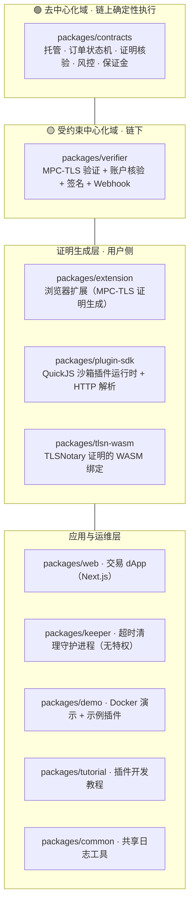

# 源码地图：论文 ↔ 代码对照

> [!NOTE]
> **本篇导读**
> - **定位**：让你「通过源码直接理解论文工作」。它是整套文档的**骨架**——其余各篇都引用这里的包职责划分与「论文概念↔源码位置」映射表。
> - **读者**：动手轨与深度轨共用。先看[总览](#1-monorepo-总览)建立心智地图，再用[映射大表](#3-论文概念--源码位置映射大表)按图索骥。
> - 事实以**实际源码**为准。所有代码引用写 `文件:行号`，可点击跳转。

---

## 1. monorepo 总览

代码位于 [`tlsn-extension/`](../../../tlsn-extension/)，采用 npm workspaces 多包结构。论文系统由**两条信任域**、**四个层次**构成；下表把论文的层次映射到代码包：

> [!NOTE]
> 「去中心化域 / 受约束中心化域」的定义见 [glossary.md](glossary.md) 与 [deep-dive/01-overview.md](../deep-dive/01-overview.md)；为何这样划分见 [deep-dive/03-threat-model.md](../deep-dive/03-threat-model.md)。

---

## 2. 逐包职责（以实际 `packages/` 为准）

| 包 | 语言 | 职责 | 论文位置 | 详解 |
|---|---|---|---|---|
| [`contracts`](../../../tlsn-extension/packages/contracts/) | Solidity 0.8.28 | 链上核心：资产托管、订单状态机、TLSN 证明核验、平台验证器、风控、保证金库 | ch4.2 | [contracts.md](contracts.md) |
| [`verifier`](../../../tlsn-extension/packages/verifier/) | Rust (Axum) | 验证服务器：跑 MPC-TLS 验证器侧、账户核验（accountCheck）、对承诺与订单绑定哈希签名、Webhook | ch4.3、ch4.4、ch5.5 | [verifier-plugin.md](verifier-plugin.md) |
| [`extension`](../../../tlsn-extension/packages/extension/) | TypeScript (MV3) | 浏览器扩展：拦截请求、在 Offscreen 用 WASM 生成 MPC-TLS 证明、运行插件 UI | ch4.3、ch5 | [verifier-plugin.md](verifier-plugin.md) |
| [`plugin-sdk`](../../../tlsn-extension/packages/plugin-sdk/) | TypeScript | 插件运行时：QuickJS WASM 沙箱、统一 `prove()`、HTTP 转录解析与选择性披露 | ch4.3、ch4.8.5 | [verifier-plugin.md](verifier-plugin.md) |
| [`tlsn-wasm`](../../../tlsn-extension/packages/tlsn-wasm/) / `tlsn-wasm-pkg` | Rust→WASM | TLSNotary 证明生成的 WASM 绑定（供扩展调用） | ch2.3、ch4.3 | — |
| [`web`](../../../tlsn-extension/packages/web/) | TypeScript (Next.js) | 交易 dApp：下单、绑定支付账户、商家挂单、管理员配置、证明提交 | ch5.4 | [code-map §4](#4-关键文件导读) |
| [`keeper`](../../../tlsn-extension/packages/keeper/) | TypeScript (viem) | 链下守护进程：监听订单事件、到期时调 `sweepExpiredBatch` 清理（**无特权，任何人可代劳**） | ch4.2.5 | [§4](#4-关键文件导读) |
| [`demo`](../../../tlsn-extension/packages/demo/) | TypeScript | Docker 演示环境 + 示例支付插件 | ch5 | [hands-on/02](../hands-on/02-demo-walkthrough.md) |
| [`tutorial`](../../../tlsn-extension/packages/tutorial/) | TypeScript | 插件开发教程 | ch5 | — |
| [`common`](../../../tlsn-extension/packages/common/) | TypeScript | 共享日志工具 | — | — |

> [!NOTE]
> 📁 `web/src/components/` 为子目录结构：`admin/ binding/ dashboard/ merchant/ orders/ p2p/ proof/ shared/ trade/ ui/ layout/`（前端业务流按此组织）。

### 合约层文件清单（`packages/contracts/contracts/`）

| 文件 | 职责 |
|---|---|
| [`C2CEscrow.sol`](../../../tlsn-extension/packages/contracts/contracts/C2CEscrow.sol) | 主合约：挂单、下单托管、平台支付核验后结算、订单状态机、超时清理、订单绑定哈希计算 |
| [`TLSNVerifier.sol`](../../../tlsn-extension/packages/contracts/contracts/TLSNVerifier.sol) | TLSN 证明密码学核验 + 验证器签名恢复 + 平台验证器注册表与统一委托入口 |
| [`C2CRiskManager.sol`](../../../tlsn-extension/packages/contracts/contracts/C2CRiskManager.sol) | 动态保证金比率、信誉/风险等级、超时罚没、冻结与衰减 |
| [`C2CBondVault.sol`](../../../tlsn-extension/packages/contracts/contracts/C2CBondVault.sol) | 保证金库：按订单隔离托管，结算后以 pull 模式（`claim()`）领取 |
| [`C2CAdmin.sol`](../../../tlsn-extension/packages/contracts/contracts/C2CAdmin.sol) | 管理：加密/法币资产注册、商家注册、单笔上限、权限 |
| [`C2CTypes.sol`](../../../tlsn-extension/packages/contracts/contracts/C2CTypes.sol) | 共享类型：`OrderStatus`、`TLSNProof`、绑定/支付信息结构、全部自定义错误 |
| [`platforms/AlipayPlatformVerifier.sol`](../../../tlsn-extension/packages/contracts/contracts/platforms/AlipayPlatformVerifier.sol) | 支付宝平台验证器（单证明） |
| [`platforms/WisePlatformVerifier.sol`](../../../tlsn-extension/packages/contracts/contracts/platforms/WisePlatformVerifier.sol) | Wise 平台验证器（contacts + transfer 双证明） |
| [`interfaces/IPlatformVerifier.sol`](../../../tlsn-extension/packages/contracts/contracts/interfaces/IPlatformVerifier.sol) | 平台验证器统一接口（可扩展机制核心） |
| [`lib/TLSNParserLib.sol`](../../../tlsn-extension/packages/contracts/contracts/lib/TLSNParserLib.sol) | 链上 JSON 字段/金额/日期解析库 |
| [`lib/UintQueue.sol`](../../../tlsn-extension/packages/contracts/contracts/lib/UintQueue.sol) | 待处理订单队列（FIFO，用于有界清理） |

---

## 3. 论文概念 ↔ 源码位置映射大表

> [!IMPORTANT]
> 这是本篇核心：论文概念 → 代码精确实现位置。

### 3.1 两大创新

| 论文概念 | 源码位置 | 状态 |
|---|---|---|
| **创新①：订单绑定哈希 H_bind（15 字段 keccak256）** | [`C2CEscrow.sol:381-413`](../../../tlsn-extension/packages/contracts/contracts/C2CEscrow.sol#L381-L413) `_computeOrderBindingHash` | ✓ |
| H_bind 在链上的强制绑定校验 | [`C2CEscrow.sol:423-425`](../../../tlsn-extension/packages/contracts/contracts/C2CEscrow.sol#L423-L425) `_requireOrderBinding` | ✓ |
| **创新②：半去中心化双域架构** | 去中心化域 = `contracts`；受约束中心化域 = `verifier` 信任名单（`trustedVerifiers`/`trustedPaymentServers`/`trustedKYBServers`） | ✓ |

### 3.2 链下证明与验证（zkTLS / TLSNotary）

| 论文概念 | 源码位置 | 状态 |
|---|---|---|
| MPC-TLS 证明生成（用户侧） | `extension`（Background/Offscreen/SessionManager）+ [`tlsn-wasm`](../../../tlsn-extension/packages/tlsn-wasm/) WASM 绑定 | ✓ |
| 统一 `prove()` API（请求→转录→选择性披露→证明） | [`plugin-sdk/src/index.ts:668`](../../../tlsn-extension/packages/plugin-sdk/src/index.ts#L668)（注入 `prove`）；HTTP 解析 [`plugin-sdk/src/parser.ts`](../../../tlsn-extension/packages/plugin-sdk/src/parser.ts) | ✓ |
| 验证器侧 MPC-TLS 协议 | [`verifier/src/verifier.rs:61-206`](../../../tlsn-extension/packages/verifier/src/verifier.rs#L61-L206) | ✓ |
| 承诺哈希算法 = Keccak256（与链上一致） | [`verifier/src/verifier.rs:225-226`](../../../tlsn-extension/packages/verifier/src/verifier.rs#L225-L226) | ✓ |
| 选择性披露 / 承诺开启校验（value+blinder 还原承诺） | [`TLSNVerifier.sol:246-262`](../../../tlsn-extension/packages/contracts/contracts/TLSNVerifier.sol#L246-L262) `_verifyCommitmentOpenings` | ✓ |
| 承诺集合哈希校验 | [`TLSNVerifier.sol:264-270`](../../../tlsn-extension/packages/contracts/contracts/TLSNVerifier.sol#L264-L270) `_verifyCommitmentsHash` | ✓ |
| `TLSNProof` 数据结构 | [`C2CTypes.sol:35-69`](../../../tlsn-extension/packages/contracts/contracts/C2CTypes.sol#L35-L69) | ✓ |

### 3.3 验证器签名（受约束中心化域的锚点）

| 论文概念 | 源码位置 | 状态 |
|---|---|---|
| 验证器签名摘要（链上恢复） = `chainId ‖ keccak(sessionId) ‖ commitmentsHash ‖ orderBindingHash ‖ policyVersionHash` | [`TLSNVerifier.sol:272-285`](../../../tlsn-extension/packages/contracts/contracts/TLSNVerifier.sol#L272-L285) `_recoverVerifierSigner` | ✓ |
| 同一摘要在链下的构造（逐字节一致） | [`verifier/src/main.rs:2064-2111`](../../../tlsn-extension/packages/verifier/src/main.rs#L2064-L2111) `sign_commitments` | ✓ |
| 签名者须在信任名单 | [`TLSNVerifier.sol:236`](../../../tlsn-extension/packages/contracts/contracts/TLSNVerifier.sol#L236) `trustedVerifiers` | ✓ |
| **账户身份核验在链下完成**（keccak256 切片比对） | [`verifier/src/main.rs:1366-1422`](../../../tlsn-extension/packages/verifier/src/main.rs#L1366-L1422) `accountCheck` | ✓ |
| policyVersion 取自插件 config | [`plugin-sdk/src/index.ts:880-884`](../../../tlsn-extension/packages/plugin-sdk/src/index.ts#L880-L884) | ✓ |

### 3.4 平台验证器（可扩展机制）

| 论文概念 | 源码位置 | 状态 |
|---|---|---|
| 统一委托入口 `verifyAndDelegate` | [`TLSNVerifier.sol:196-223`](../../../tlsn-extension/packages/contracts/contracts/TLSNVerifier.sol#L196-L223) | ✓ |
| 平台验证器统一接口 | [`interfaces/IPlatformVerifier.sol`](../../../tlsn-extension/packages/contracts/contracts/interfaces/IPlatformVerifier.sol) | ✓ |
| paramsData = 4 字段（含 `orderCreationTime`，支付时间窗 `[创建, 截止]`） | [`IPlatformVerifier.sol:10-18`](../../../tlsn-extension/packages/contracts/contracts/interfaces/IPlatformVerifier.sol#L10-L18)；构造于 [`C2CEscrow.sol:633-637`](../../../tlsn-extension/packages/contracts/contracts/C2CEscrow.sol#L633-L637) | ✓ |
| 支付宝校验（status/bizType/金额/orderId 去重/时间窗） | [`AlipayPlatformVerifier.sol`](../../../tlsn-extension/packages/contracts/contracts/platforms/AlipayPlatformVerifier.sol) | ✓ |
| Wise 校验（state/金额/币种/transferId 去重/时间窗；contacts 证明结构必需，账户内容由 VS 链下核验） | [`WisePlatformVerifier.sol`](../../../tlsn-extension/packages/contracts/contracts/platforms/WisePlatformVerifier.sol)（`_verifyContacts:121-123`） | ✓ |
| 链上 JSON 解析库 | [`lib/TLSNParserLib.sol`](../../../tlsn-extension/packages/contracts/contracts/lib/TLSNParserLib.sol) | ✓ |

### 3.5 订单、托管与状态机

| 论文概念 | 源码位置 | 状态 |
|---|---|---|
| 订单状态集合 Q `{PENDING, WAITING, COMPLETED, EXPIRED}` | [`C2CTypes.sol:13-18`](../../../tlsn-extension/packages/contracts/contracts/C2CTypes.sol#L13-L18) | ✓ |
| 下单托管（CRYPTO 初态 PENDING / FIAT 初态 WAITING） | [`C2CEscrow.sol:446-589`](../../../tlsn-extension/packages/contracts/contracts/C2CEscrow.sol#L446-L589) `placeOrder` | ✓ |
| 商家挂单 | [`C2CEscrow.sol:261-311`](../../../tlsn-extension/packages/contracts/contracts/C2CEscrow.sol#L261-L311) `listCryptoProduct`/`listFiatProduct` | ✓ |
| 买方付（CRYPTO）核验结算 | [`C2CEscrow.sol:609-664`](../../../tlsn-extension/packages/contracts/contracts/C2CEscrow.sol#L609-L664) `payOrderByPlatform` | ✓ |
| 商家付（FIAT）核验结算 | [`C2CEscrow.sol:670-737`](../../../tlsn-extension/packages/contracts/contracts/C2CEscrow.sol#L670-L737) `receiveCryptoWithPlatformPayment` | ✓ |
| `cancelOrder` 被禁用（直接 revert） | [`C2CEscrow.sol:601-603`](../../../tlsn-extension/packages/contracts/contracts/C2CEscrow.sol#L601-L603) | ✓ |
| 超时清理（permissionless，任何人可调） | [`C2CEscrow.sol:889-908`](../../../tlsn-extension/packages/contracts/contracts/C2CEscrow.sol#L889-L908) `sweepExpired`/`sweepExpiredBatch` | ✓ |
| 法币金额换算（×1000） / 汇率精度 1e8 | [`C2CEscrow.sol:250-259`](../../../tlsn-extension/packages/contracts/contracts/C2CEscrow.sol#L250-L259) `_computeFiatAmountX1000`、[`:106`](../../../tlsn-extension/packages/contracts/contracts/C2CEscrow.sol#L106) `RATE_PRECISION_EXP` | ✓ |

### 3.6 风控、信誉与保证金

| 论文概念 | 源码位置 | 状态 |
|---|---|---|
| 动态保证金比率 bps（随风险等级递增） | [`C2CRiskManager.sol:31-40`](../../../tlsn-extension/packages/contracts/contracts/C2CRiskManager.sol#L31-L40)（参数）、[`:129-143`](../../../tlsn-extension/packages/contracts/contracts/C2CRiskManager.sol#L129-L143) `requiredBondBps` | ✓ |
| 保证金额 = 金额 × bps / 1e4 | [`C2CEscrow.sol:505,539`](../../../tlsn-extension/packages/contracts/contracts/C2CEscrow.sol#L505) `Math.mulDiv` | ✓ |
| 信誉递进 / 成功奖励 / 超时罚没 / 冻结 | [`C2CRiskManager.sol:160-193`](../../../tlsn-extension/packages/contracts/contracts/C2CRiskManager.sol#L160-L193) `onCompleted`/`onTimeout` | ✓ |
| 信誉随时间衰减 | [`C2CRiskManager.sol:197-211`](../../../tlsn-extension/packages/contracts/contracts/C2CRiskManager.sol#L197-L211) `_effectiveRiskLevel`/`_applyDecay` | ✓ |
| 保证金键 orderKey（6 字段隔离） | [`C2CEscrow.sol:431-440`](../../../tlsn-extension/packages/contracts/contracts/C2CEscrow.sol#L431-L440) `_orderKey` | ✓ |
| 保证金库隔离托管 + 结算 | [`C2CBondVault.sol:67-111`](../../../tlsn-extension/packages/contracts/contracts/C2CBondVault.sol#L67-L111) `createOrderBond`/`settle` | ✓ |
| 保证金 pull 领取（claimable + 哨兵位 gas 优化） | [`C2CBondVault.sol:120-144`](../../../tlsn-extension/packages/contracts/contracts/C2CBondVault.sol#L120-L144) `initClaimable`/`claim`/`_credit` | ✓ |

### 3.7 重放防护（多层）

| 论文概念 | 源码位置 | 状态 |
|---|---|---|
| 会话去重（sessionId） | [`TLSNVerifier.sol:240-244`](../../../tlsn-extension/packages/contracts/contracts/TLSNVerifier.sol#L240-L244) `_checkAndMarkSessionId` | ✓ |
| 平台交易去重（orderId / transferId） | `AlipayPlatformVerifier.usedAlipayOrderIds`、`WisePlatformVerifier.usedTransferIds` | ✓ |
| 订单绑定不可分离（H_bind） | [`C2CEscrow.sol:381-425`](../../../tlsn-extension/packages/contracts/contracts/C2CEscrow.sol#L381-L425) | ✓ |
| 支付时间窗下限（防旧转账复用） | `orderCreationTime` 校验（见 §3.4） | ✓ |

### 3.8 链下运维（验证服务器 / keeper）

| 论文概念 | 源码位置 | 状态 |
|---|---|---|
| 验证服务器入口与会话流 | [`verifier/src/main.rs`](../../../tlsn-extension/packages/verifier/src/main.rs)、[`verifier/src/ws.rs`](../../../tlsn-extension/packages/verifier/src/ws.rs) | ✓ |
| Webhook（按 server 配置） | [`verifier/src/webhook.rs`](../../../tlsn-extension/packages/verifier/src/webhook.rs) | 🔍 详见 verifier-plugin |
| 超时自动结算 keeper（无特权守护进程） | [`keeper/src/index.ts`](../../../tlsn-extension/packages/keeper/src/index.ts)、[`sweeper.ts`](../../../tlsn-extension/packages/keeper/src/sweeper.ts)、[`eventListener.ts`](../../../tlsn-extension/packages/keeper/src/eventListener.ts)、[`replay.ts`](../../../tlsn-extension/packages/keeper/src/replay.ts) | ✓ |

---

## 4. 关键文件导读

想最快读懂协议，按这个顺序读源码：

1. **[`C2CTypes.sol`](../../../tlsn-extension/packages/contracts/contracts/C2CTypes.sol)** — 先看类型与错误：`OrderStatus`、`TLSNProof`、绑定/支付信息结构。一眼掌握数据模型。
2. **[`C2CEscrow.sol`](../../../tlsn-extension/packages/contracts/contracts/C2CEscrow.sol)** — 协议主干。重点：`placeOrder`（双协议分支与双边保证金，:446-589）、`_computeOrderBindingHash`（创新①，:381-413）、`payOrderByPlatform`/`receiveCryptoWithPlatformPayment`（核验后结算）。
3. **[`TLSNVerifier.sol`](../../../tlsn-extension/packages/contracts/contracts/TLSNVerifier.sol)** — 证明如何被链上信任：`verifyAndDelegate`（:196-223）→ `_verifyTLSNProof`（:229-238）→ 承诺校验与签名恢复（:246-285）。
4. **[`platforms/*.sol`](../../../tlsn-extension/packages/contracts/contracts/platforms/)** — 平台业务规则。Wise `_verifyContacts` 为空函数，账户核验在 VS 链下完成。
5. **[`verifier/src/main.rs`](../../../tlsn-extension/packages/verifier/src/main.rs)** — 链下镜像：`accountCheck`（:1366-1422）与 `sign_commitments`（:2064-2111）。把它与 `TLSNVerifier._recoverVerifierSigner` 对读，理解链下/链上如何咬合。
6. **[`plugin-sdk/src/index.ts`](../../../tlsn-extension/packages/plugin-sdk/src/index.ts)** — 插件如何在 QuickJS 沙箱里跑、`prove()` 如何注入（:455-463 沙箱配置，:668 prove）。
7. **[`keeper/src/index.ts`](../../../tlsn-extension/packages/keeper/src/index.ts)** — 链下守护进程生命周期；`sweeper.ts` 看 replace-by-fee 重试与 gas 上限。

**部署产物**：本地链 chainId=31337，部署脚本见 [`packages/contracts/scripts/`](../../../tlsn-extension/packages/contracts/scripts/)（`deploy-web.ts`/`deploy-local.ts` 等），产物地址见 [`deployments/web-31337.json`](../../../tlsn-extension/packages/contracts/deployments/web-31337.json)、`demo-31337.json`。**部署顺序以脚本为准**（见 [contracts.md](contracts.md)）。

---

## 5. 阅读路线

| 你的目标 | 推荐路线 |
|---|---|
| 跑通本地最小闭环 | [hands-on/01-quickstart.md](../hands-on/01-quickstart.md) → 本篇 §4 |
| 读懂协议设计与创新 | [deep-dive/01-overview.md](../deep-dive/01-overview.md) → [04-protocol-design.md](../deep-dive/04-protocol-design.md) → 本篇 §3 |
| 核对安全论证 | [deep-dive/03-threat-model.md](../deep-dive/03-threat-model.md) → [05-security-analysis.md](../deep-dive/05-security-analysis.md) → 本篇 §3.3/§3.7 |
| 改合约 / 加支付平台 | [contracts.md](contracts.md) + [verifier-plugin.md](verifier-plugin.md) |
| 复核实验数据 | [deep-dive/06-evaluation.md](../deep-dive/06-evaluation.md) |

> [!TIP]
> 名词不懂？查 [glossary.md](glossary.md)。

---

🏠 [文档导航](../README.md) · 🚀 [快速上手](../hands-on/01-quickstart.md) · 🧠 [深度轨](../deep-dive/01-overview.md) · 📚 [合约速查](contracts.md)

