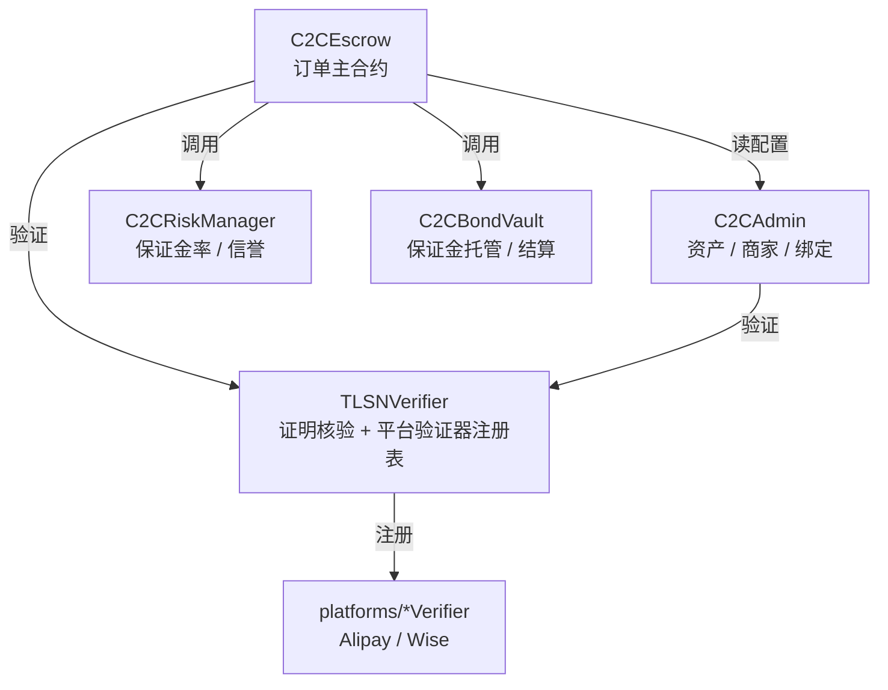

# 合约接口速查

> [!NOTE]
> **本篇导读**
> - **定位**：想读或改合约的同学的速查手册——依赖关系、各合约关键函数/事件/权限、订单状态机、部署顺序。
> - **读者**：开发者。先读 [code-map.md](code-map.md) 建立全局，再用本篇查接口。
> - 合约源码在 [`tlsn-extension/packages/contracts/contracts/`](../../../tlsn-extension/packages/contracts/contracts/)，Solidity **0.8.28**、EVM cancun。所有事实以源码为准。

**目录**：[依赖关系](#1-合约依赖关系) · [关键接口](#2-各合约关键接口) · [订单状态机](#3-订单状态机) · [部署顺序](#4-部署顺序与地址)

---

## 1. 合约依赖关系

部署后通过构造参数与 setter 互相接线（箭头 = 引用/调用方向）：

- `C2CEscrow` 是协议主干，持有对 `C2CAdmin`/`TLSNVerifier`/`C2CRiskManager`/`C2CBondVault` 的引用（[C2CEscrow.sol:36-39](../../../tlsn-extension/packages/contracts/contracts/C2CEscrow.sol#L36-L39)）。
- `TLSNVerifier` 通过 `platformVerifiers` 注册表持有各平台验证器；新增平台**无需改动任何已部署合约**。
- `C2CRiskManager` 与 `C2CBondVault` 都只接受 `escrow` 调用（`onlyEscrow`），支持两步迁移 escrow。

---

## 2. 各合约关键接口

### 2.1 `C2CEscrow`（订单主合约）

源码：[C2CEscrow.sol](../../../tlsn-extension/packages/contracts/contracts/C2CEscrow.sol)

**外部函数**

| 函数 | 行 | 权限 | 说明 |
|---|---|---|---|
| `listCryptoProduct` / `listFiatProduct` | [:261](../../../tlsn-extension/packages/contracts/contracts/C2CEscrow.sol#L261) / [:287](../../../tlsn-extension/packages/contracts/contracts/C2CEscrow.sol#L287) | `onlyMerchant` | 商家上架 CRYPTO/FIAT 产品（含抵押 collateral、平台 ID） |
| `placeOrder` | [:446](../../../tlsn-extension/packages/contracts/contracts/C2CEscrow.sol#L446) | 任意买家 | 下单锁仓 + 计算并锁定双边保证金；CRYPTO 初态 `PENDING`、FIAT 初态 `WAITING` |
| `payOrderByPlatform` | [:609](../../../tlsn-extension/packages/contracts/contracts/C2CEscrow.sol#L609) | `onlyAuthorized` 流程 | CRYPTO 买方付款证明核验 → 放币、退买方保证金 |
| `receiveCryptoWithPlatformPayment` | [:670](../../../tlsn-extension/packages/contracts/contracts/C2CEscrow.sol#L670) | 流程 | FIAT 商家付款证明核验 → 放币、退商家保证金 |
| `sweepExpired` / `sweepExpiredBatch` | [:889](../../../tlsn-extension/packages/contracts/contracts/C2CEscrow.sol#L889) / [:904](../../../tlsn-extension/packages/contracts/contracts/C2CEscrow.sol#L904) | **任何人**（permissionless） | 清理过期订单 → `EXPIRED`，保证金归对手方 |
| `cleanupProductExpired` | [:591](../../../tlsn-extension/packages/contracts/contracts/C2CEscrow.sol#L591) | 任意 | 单产品有界清理 |
| `cancelOrder` | [:601](../../../tlsn-extension/packages/contracts/contracts/C2CEscrow.sol#L601) | — | **已禁用**，直接 revert `OrderCancellationDisabled` |

> [!TIP]
> `sweepExpired*` 位于「Public Sweep (anyone-callable)」段，仅 `whenNotPaused nonReentrant`、**无权限修饰符**——任何人都能触发过期清理。链下 [keeper](../../../tlsn-extension/packages/keeper/) 只是便利角色，不掌握特权。这是去中心化论证的一环（见 [03-threat-model.md](../deep-dive/03-threat-model.md)）。

**内部关键逻辑**

| 函数 | 行 | 说明 |
|---|---|---|
| `_computeOrderBindingHash` | [:381-413](../../../tlsn-extension/packages/contracts/contracts/C2CEscrow.sol#L381-L413) | **创新①**：15 字段 keccak256 → H_bind |
| `_requireOrderBinding` | [:423-425](../../../tlsn-extension/packages/contracts/contracts/C2CEscrow.sol#L423-L425) | 强制每个证明绑定本订单 |
| `_orderKey` | [:431-440](../../../tlsn-extension/packages/contracts/contracts/C2CEscrow.sol#L431-L440) | 6 字段保证金隔离键 |
| `_computeFiatAmountX1000` | [:250-259](../../../tlsn-extension/packages/contracts/contracts/C2CEscrow.sol#L250-L259) | 法币金额 ×1000；汇率精度 `RATE_PRECISION_EXP=8` |

> [!TIP]
> 核验时构造的 `paramsData` 含 4 个字段（含 `orderCreationTime = deadline - ORDER_TIMEOUT`，[:633-637](../../../tlsn-extension/packages/contracts/contracts/C2CEscrow.sol#L633-L637)），支付时间须落在 `[创建时间, 截止时间]` 窗口内，防止旧/过期转账复用。

**事件**：`ProductListed`([:114](../../../tlsn-extension/packages/contracts/contracts/C2CEscrow.sol#L114))、`ProductStatusChanged`、`ProductCollateralChanged`、`OrderPlaced`([:138](../../../tlsn-extension/packages/contracts/contracts/C2CEscrow.sol#L138))、`BuyerPaymentInfoSet`、`OrderStatusChanged`([:156](../../../tlsn-extension/packages/contracts/contracts/C2CEscrow.sol#L156))、`BuyerEscrowDeposited`、`OrderProofLinked`、`Paused`/`Unpaused`、`ExpiredSwept`([:183](../../../tlsn-extension/packages/contracts/contracts/C2CEscrow.sol#L183))。

**关键常量**（[:102-106](../../../tlsn-extension/packages/contracts/contracts/C2CEscrow.sol#L102-L106)）：`MAX_PENDING_ORDERS=200`、`MAX_SWEEP_BATCH=20`、`ORDER_TIMEOUT=15 分钟`、`RATE_PRECISION_EXP=8`。

**修饰符**：`onlyMerchant`([:195](../../../tlsn-extension/packages/contracts/contracts/C2CEscrow.sol#L195))、`whenNotPaused`([:200](../../../tlsn-extension/packages/contracts/contracts/C2CEscrow.sol#L200))、`nonReentrant`（OZ）。

### 2.2 `TLSNVerifier`（证明核验 + 平台注册表）

源码：[TLSNVerifier.sol](../../../tlsn-extension/packages/contracts/contracts/TLSNVerifier.sol)

| 函数 | 行 | 权限 | 说明 |
|---|---|---|---|
| `verifyProof` | [:164](../../../tlsn-extension/packages/contracts/contracts/TLSNVerifier.sol#L164) | `onlyAuthorized` | 仅做证明密码学核验 |
| `verifyKYB` | [:168](../../../tlsn-extension/packages/contracts/contracts/TLSNVerifier.sol#L168) | `onlyAuthorized` | 核验 + 匹配 KYB「verified」 |
| `verifyAndDelegate` | [:196-223](../../../tlsn-extension/packages/contracts/contracts/TLSNVerifier.sol#L196-L223) | `onlyAuthorized` | **统一委托入口**：核验每个证明 → 查注册表 → 委托平台验证器 |
| `setPlatformVerifier` | [:154](../../../tlsn-extension/packages/contracts/contracts/TLSNVerifier.sol#L154) | `onlyAdmin` | 注册/更新平台验证器（可扩展核心） |
| `addTrustedVerifier` / `add/removeTrusted{KYB,Payment}Server` | [:119-147](../../../tlsn-extension/packages/contracts/contracts/TLSNVerifier.sol#L119-L147) | `onlyAdmin` | 维护信任名单 |
| `setAuthorizedCaller` | [:114](../../../tlsn-extension/packages/contracts/contracts/TLSNVerifier.sol#L114) | `onlyAdmin` | 授权 Admin/Escrow 调用 |
| `proposeAdmin` / `acceptAdmin` | [:101](../../../tlsn-extension/packages/contracts/contracts/TLSNVerifier.sol#L101) / [:107](../../../tlsn-extension/packages/contracts/contracts/TLSNVerifier.sol#L107) | 两步 | admin 转移 |

**核验内部**：`_verifyTLSNProof`([:229](../../../tlsn-extension/packages/contracts/contracts/TLSNVerifier.sol#L229))→ `_checkAndMarkSessionId`（会话去重）+ `_verifyCommitmentOpenings`/`_verifyCommitmentsHash`（承诺校验）+ `_recoverVerifierSigner`（[:272-285](../../../tlsn-extension/packages/contracts/contracts/TLSNVerifier.sol#L272-L285)，恢复签名者并查 `trustedVerifiers`）。

**注册表/信任名单**：`trustedVerifiers`、`trustedKYBServers`、`trustedPaymentServers`、`platformVerifiers`、`usedSessionIds`（[:41-50](../../../tlsn-extension/packages/contracts/contracts/TLSNVerifier.sol#L41-L50)）；内置平台 ID `PLATFORM_WISE`/`PLATFORM_ALIPAY`。

### 2.3 `C2CRiskManager`（动态保证金 + 信誉）

源码：[C2CRiskManager.sol](../../../tlsn-extension/packages/contracts/contracts/C2CRiskManager.sol)

**默认参数**（[:31-40](../../../tlsn-extension/packages/contracts/contracts/C2CRiskManager.sol#L31-L40)，可由 admin 经 `setRiskConfig` 调整）：

| 参数 | 默认值 | 含义 |
|---|---|---|
| `minBondBps` | 500 | 保证金率下限 5%（忠诚用户折扣后） |
| `baseBondBps` | 1000 | 基础保证金率 10% |
| `maxBondBps` | 10000 | 上限 100% |
| `stepBps` | 300 | 每风险等级 +3% |
| `maxRiskLevel` | 10 | 风险等级上限 |
| `resetThreshold` | 3 | 连续完成数达此值清零连续超时计数 |
| `freezeThreshold` | 15 | 累计超时数达此值触发冻结 |
| `freezeDays` | 30 | 冻结天数 |
| `rewardCompletedThreshold` | 10 | 完成数达此值且风险归零→降至下限 |
| `decayIntervalDays` | 90 | 风险等级衰减周期 |

> [!TIP]
> L=10 时 `raw = 1000 + 10×300 = 4000 bps = 40%`（未触 100% 上限，上限为可调极端值）。演示部署脚本 [`deploy-web.ts`](../../../tlsn-extension/packages/contracts/scripts/deploy-web.ts#L393-L403) 会把 `freeze=3, decay=1` 等改为演示值——那是部署时配置，非合约默认。

| 函数 | 行 | 权限 | 说明 |
|---|---|---|---|
| `requiredBondBps(user)` | [:129](../../../tlsn-extension/packages/contracts/contracts/C2CRiskManager.sol#L129) | view | 返回当前保证金率（黑名单/冻结 revert） |
| `onCompleted` / `onTimeout` | [:160](../../../tlsn-extension/packages/contracts/contracts/C2CRiskManager.sol#L160) / [:172](../../../tlsn-extension/packages/contracts/contracts/C2CRiskManager.sol#L172) | `onlyEscrow` | 成功降级 / 超时升级（连续超时 +1/+2/+3 递进），达阈值冻结 |
| `setRiskConfig` | [:86](../../../tlsn-extension/packages/contracts/contracts/C2CRiskManager.sol#L86) | `onlyAdmin` | 调整参数 |
| `setBlacklist` / `manualUnfreeze` | [:116](../../../tlsn-extension/packages/contracts/contracts/C2CRiskManager.sol#L116) / [:121](../../../tlsn-extension/packages/contracts/contracts/C2CRiskManager.sol#L121) | `onlyAdmin` | 黑名单 / 手动解冻 |
| `initReputation` | [:110](../../../tlsn-extension/packages/contracts/contracts/C2CRiskManager.sol#L110) | 任意 | 预热存储槽省 gas（写 `initialized`） |

### 2.4 `C2CBondVault`（保证金库）

源码：[C2CBondVault.sol](../../../tlsn-extension/packages/contracts/contracts/C2CBondVault.sol)

| 函数 | 行 | 权限 | 说明 |
|---|---|---|---|
| `createOrderBond` | [:67](../../../tlsn-extension/packages/contracts/contracts/C2CBondVault.sol#L67) | `onlyEscrow` | 按 orderKey 隔离登记保证金 |
| `settle(orderKey, stype)` | [:84](../../../tlsn-extension/packages/contracts/contracts/C2CBondVault.sol#L84) | `onlyEscrow` | 结算：`PROOF_SUCCESS`→退 prover，否则→对手方 |
| `settle(orderKey, stype, proverExtra, counterpartExtra)` | [:96](../../../tlsn-extension/packages/contracts/contracts/C2CBondVault.sol#L96) | `onlyEscrow` | 带额外分配的结算重载 |
| `claim(token)` | [:126](../../../tlsn-extension/packages/contracts/contracts/C2CBondVault.sol#L126) | 任意 | **pull 领取**已结算保证金 |
| `claimableBalance` / `initClaimable` | [:135](../../../tlsn-extension/packages/contracts/contracts/C2CBondVault.sol#L135) / [:120](../../../tlsn-extension/packages/contracts/contracts/C2CBondVault.sol#L120) | view / 任意 | 查可领余额 / 预热哨兵位省 gas |

> [!TIP]
> 结算为 **pull 模式**——保证金先 `_credit` 进 `_claimable`，用户须自行 `claim()` 取回；`initClaimable` 写哨兵值 1 保持存储槽 warm（冷写 20000 gas→热写 2900 gas）。

### 2.5 `C2CAdmin`（配置中心）

源码：[C2CAdmin.sol](../../../tlsn-extension/packages/contracts/contracts/C2CAdmin.sol)

| 函数 | 行 | 权限 | 说明 |
|---|---|---|---|
| `addCryptoInfo` / `addFiatInfo` | [:128](../../../tlsn-extension/packages/contracts/contracts/C2CAdmin.sol#L128) / [:143](../../../tlsn-extension/packages/contracts/contracts/C2CAdmin.sol#L143) | `onlyAdmin` | 注册支持的加密/法币资产 |
| `activateAsset` / `deactivateAsset` | [:156](../../../tlsn-extension/packages/contracts/contracts/C2CAdmin.sol#L156) / [:169](../../../tlsn-extension/packages/contracts/contracts/C2CAdmin.sol#L169) | `onlyAdmin` | 启停资产 |
| `registerMerchant` / `registerMerchantByAdmin` | [:221](../../../tlsn-extension/packages/contracts/contracts/C2CAdmin.sol#L221) / [:234](../../../tlsn-extension/packages/contracts/contracts/C2CAdmin.sol#L234) | KYB 证明 / `onlyAdmin` | 商家入驻（需 KYB） |
| `setPlatformBinding` | [:264](../../../tlsn-extension/packages/contracts/contracts/C2CAdmin.sol#L264) | 任意钱包 | 绑定支付账户：**仅存 keccak256(name)/(id) 承诺**，明文+salt 由服务器 DB 持有 |
| `publishRate` | [:308](../../../tlsn-extension/packages/contracts/contracts/C2CAdmin.sol#L308) | 商家 | 发布汇率（×1e8 编码，带版本号） |
| `setBusinessHours` / `openNow` / `closeNow` / `clearManualOverride` | [:325](../../../tlsn-extension/packages/contracts/contracts/C2CAdmin.sol#L325)+ | 商家 | 营业时间与手动开关 |
| `setMaxOrderAmount` | [:394](../../../tlsn-extension/packages/contracts/contracts/C2CAdmin.sol#L394) | `onlyAdmin` | 单笔上限，默认 `1000 × 1e18`（18 位规整，等价 1000 整币） |

> 账户隐私：`setPlatformBinding` 上链的是 `nameHash`/`idHash` 承诺（[:264-278](../../../tlsn-extension/packages/contracts/contracts/C2CAdmin.sol#L264-L278)），明文与随机 salt 仅存于链下数据库。支付宝场景因证明只揭示**掩码后**的收款人身份，绑定会对**掩码值**取承诺（见 [`deploy-web.ts:44-61`](../../../tlsn-extension/packages/contracts/scripts/deploy-web.ts#L44-L61)）。详见 [05-security-analysis.md](../deep-dive/05-security-analysis.md)。

---

## 3. 订单状态机

状态集合 `Q = {PENDING, WAITING, COMPLETED, EXPIRED}`（[C2CTypes.sol:13-18](../../../tlsn-extension/packages/contracts/contracts/C2CTypes.sol#L13-L18)）。无 `CANCELLED`/`DISPUTED`，`cancelOrder` 禁用。

| 起始 | 触发 | 终态 | 函数 |
|---|---|---|---|
| — | 买家下单（CRYPTO，买方付） | `PENDING` | `placeOrder`（:516） |
| — | 买家下单（FIAT，商家付） | `WAITING` | `placeOrder`（:573） |
| `PENDING` | 买方付款证明核验通过 | `COMPLETED` | `payOrderByPlatform` |
| `WAITING` | 商家付款证明核验通过 | `COMPLETED` | `receiveCryptoWithPlatformPayment` |
| `PENDING`/`WAITING` | 超过 `deadline`（15 分钟） | `EXPIRED` | `sweepExpired*` / `cleanupProductExpired`（任何人可调） |

> 完整迁移与保证金归属见 [04-protocol-design.md](../deep-dive/04-protocol-design.md)。

---

## 4. 部署顺序与地址

**部署顺序以脚本为准**（[`scripts/deploy-web.ts`](../../../tlsn-extension/packages/contracts/scripts/deploy-web.ts)，**非** `CONTRACT_STRUCTURE 附录A`）。本地链 chainId=`31337`。

1. `MockERC20` 测试代币（USDT/USDC，由 `assets.json` 驱动）
2. `TLSNVerifier`（无构造参数，部署者即 admin）
3. `C2CAdmin(tlsnVerifier)`
4. `C2CEscrow(c2cAdmin, tlsnVerifier)`
5. `C2CBondVault(c2cAdmin)`
6. `C2CRiskManager(c2cAdmin)`
7. `WisePlatformVerifier(tlsnVerifier)`、`AlipayPlatformVerifier(tlsnVerifier)`
8. **跨合约接线**：`tlsnVerifier.setAuthorizedCaller(admin/escrow)`、`c2cAdmin.setAuthorizedCaller(escrow)`、`bondVault.setEscrow(escrow)`、`riskManager.setEscrow(escrow)`、`escrow.setManagers(riskManager, bondVault)`
9. `addTrustedVerifier(签名地址)`
10. `addTrustedKYBServer` / `addTrustedPaymentServer`（默认 `wise.com`、`mbillexprod.alipay.com`）
11. `setPlatformVerifier(PLATFORM_WISE / PLATFORM_ALIPAY)`

产物地址写入 [`deployments/web-31337.json`](../../../tlsn-extension/packages/contracts/deployments/web-31337.json)（keeper 与前端从此读取地址与 `deploymentBlock`）与 `packages/web/.env.local`。

> [!TIP]
> 实跑部署见 [hands-on/01-quickstart.md](../hands-on/01-quickstart.md)。接入新支付平台见 [verifier-plugin.md](verifier-plugin.md)。

---

🏠 [文档导航](../README.md) · 📚 [源码地图](code-map.md) · 🔌 [验证器与插件](verifier-plugin.md) · 🧠 [协议设计](../deep-dive/04-protocol-design.md)

